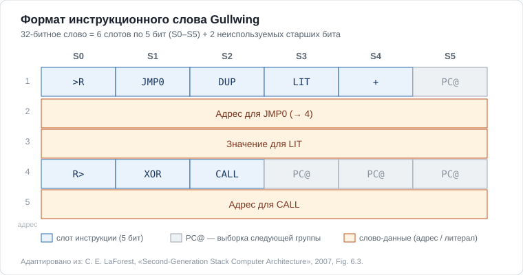
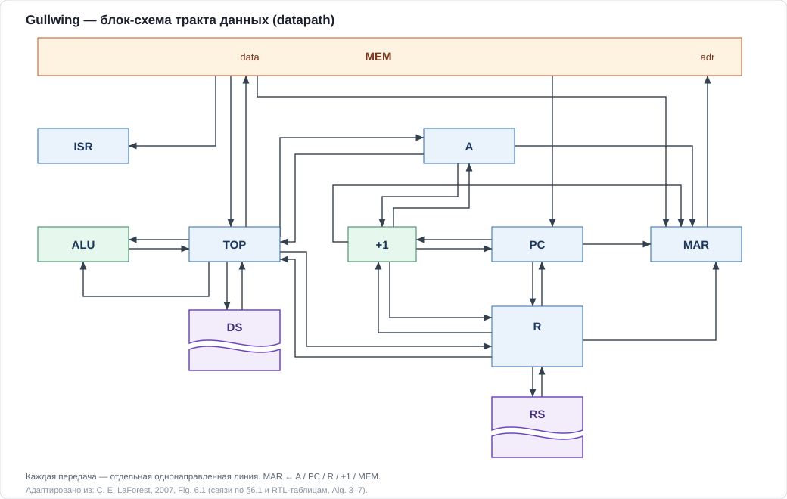
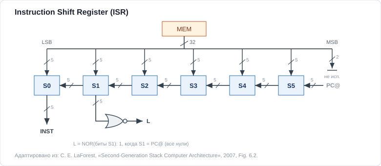
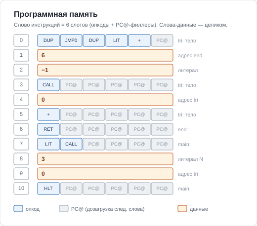
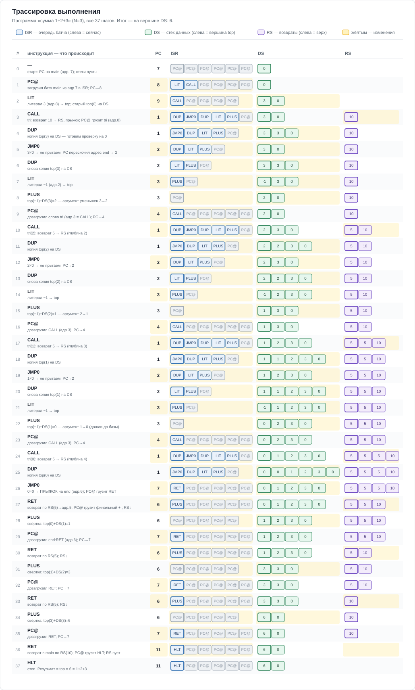

# Стековая машина на OCaml

Ассемблер и пошаговый интерпретатор стекового процессора.

Проект «для себя»: хотелось вплотную разобраться в архитектуре стековых машин и собрать
одну с нуля — по описанию машины Gullwing из работы Ч. Э. Лафореста «Second-Generation
Stack Computer Architecture».

**Что такое стековая машина.**

В отличие от привычных процессоров с регистрами общего назначения, здесь операнды лежат
на стеке, а инструкции безадресные: `+` снимает два верхних числа и кладёт сумму обратно
(постфиксная, «обратная польская» запись).

Благодаря этому инструкции получаются крошечными — в них нет полей под операнды или адрес.
В Gullwing опкод занимает всего 5 бит, так что в одно 32-битное слово помещается сразу
шесть инструкций. Отсюда высокая плотность кода и малый трафик выборки: за одно обращение
к памяти процессор забирает целую пачку инструкций. Возможна даже ситуация, когда вся
программа целиком помещается в кэш процессора.

Отдельный стек возвратов делает вызовы подпрограмм очень дешёвыми — такие машины особенно
сильны на рекурсивном и глубоко вложенном коде.

Исторически их применяют во встраиваемых системах и там, где важно жёсткое реальное время.

## Формат инструкций

Инструкции упакованы по шесть в 32-битное слово: шесть 5-битных слотов (S0–S5) плюс
два неиспользуемых старших бита. Именно это распаковывает `word_to_batch` в
[lib/machine.ml](lib/machine.ml). Слова-данные (адреса переходов, литералы) занимают
слово целиком.



Диаграмма перерисована по мотивам Fig. 6.3 из работы LaForest (см. «Источники и атрибуция»).

## Архитектура

Тракт данных: память (`MEM`), два стека — данных (`DS`) и возвратов (`RS`), регистры
`TOP`, `A`, `PC`, `MAR`, инкрементор `+1` и `ALU`. Это ровно поля записи `state` в
[lib/machine.ml](lib/machine.ml); `MAR` может загружаться из `A`, `PC`, `R`, `+1` или
`MEM`, а `TOP` — центральная точка, обменивающаяся с `ALU`, `DS`, `A`, `R` и памятью.



Выборка инструкций: слово из памяти параллельно грузится в шесть 5-битных слотов
`S0…S5`, дальше содержимое сдвигается к `S0` (текущая инструкция — `INST`), а справа
дозагружается `PC@`. Это регистр `isr` и функции `word_to_batch` / `load_isr` /
`isr_shift` в [lib/machine.ml](lib/machine.ml).



Обе диаграммы перерисованы по мотивам Fig. 6.1 и 6.2 из работы LaForest (см. «Источники и атрибуция»).

## Примеры работы

### Синтаксис ассемблера

Программа — это текст: метки вида `name:`, инструкции через пробелы/переводы строк,
аргументы (число или имя метки) идут сразу после опкода. Точка входа — метка `main`.
`+` — синоним `PLUS`. Пример — треугольные числа (сумма `1 + 2 + … + N`) через рекурсию:

```
tri:
    DUP JMP0 end DUP LIT -1 PLUS CALL tri PLUS
end:
    RET

main:
    LIT 5
    CALL tri
    HLT
```

### Ассемблирование в машинные слова

```ocaml
open Gullwing

let program = "main:\n  LIT 5\n  LIT 3\n  +\n  HLT\n"

(* Собрать исходник в слова памяти *)
let words = Pipeline.pipe program
(* words = [0xDA9AD; 0x5; 0x3]
   первое слово пакует слоты [LIT; LIT; PLUS; HLT] (+ PC-филлеры),
   дальше — два литерала: 5 и 3 *)
```

### Выполнение с трассировкой

```ocaml
open Gullwing

let program = "main:\n  LIT 5\n  LIT 3\n  +\n  HLT\n"

let () =
  let encoded, pc = Pipeline.pipe_main program in    (* pc — адрес метки main *)
  let mem = Util.fill_rest 12 0 encoded in           (* дополнить память нулями *)
  let start = Machine.{ blank_state with mem; pc; mar = pc } in
  try Machine.(start |> debug_state |> step) |> ignore
  with Machine.Halt -> ()                             (* HLT поднимает Machine.Halt *)
```

`step` выполняет по одному опкоду, `debug_state` печатает состояние на каждом шаге.
Результат остаётся на вершине стека (`top`). Хвост трассировки для примера выше:

```
LIT
{ ... ds = [0];    ... top = 5; ... }
LIT
{ ... ds = [5; 0]; ... top = 3; ... }
PLUS
{ ... ds = [0];    ... top = 8; ... }
HLT
```

Вывод заканчивается на `HLT`: `step` печатает опкод и поднимает `Machine.Halt`, который
обработчик `with Machine.Halt -> ()` гасит молча. То есть `5 + 3 = 8` (значение в `top`).
Треугольная программа выше по той же схеме оставляет `top = 15`.

### Сборка и тесты проекта

```bash
dune build
dune test
```

## Как исполняется программа

Разберём выполнение программы «сумма 1+2+3» (N=3) по шагам. Сначала — как программа
лежит в памяти: слова инструкций пакуют по шесть опкодов (плюс `PC@`-филлеры для
дозагрузки следующего слова), а слова-данные (адреса переходов, литералы) занимают
слово целиком.



Ниже — полная трассировка всех 37 шагов. В каждой строке видно, куда указывает `PC`,
очередь опкодов в `ISR`, стек данных `DS` и стек возвратов `RS`; жёлтым отмечено, что
изменилось на шаге. На спуске рекурсии `CALL` роняет адреса возврата в `RS`, а `DS`
копит аргументы; на подъёме `+` сворачивает их в сумму. Итог — на вершине `DS`: 6.



## Источники и атрибуция

Проект основан на архитектуре стековой машины **Gullwing**, описанной в дипломной работе:

> Charles Eric LaForest. *Second-Generation Stack Computer Architecture*.
> Thesis, Bachelor of Independent Studies, Independent Studies Program,
> University of Waterloo, Canada, апрель 2007.
> <https://fpgacpu.ca/stack/Second-Generation_Stack_Computer_Architecture.pdf>

**Как в этом репозитории используются материалы работы:**

- Пояснения и формулировки изложены своими словами со ссылкой на источник.
- Диаграммы и таблицы, если они приводятся, перерисованы и пересоставлены заново, с
  пометкой «адаптировано из [LaForest 2007]». Дословное воспроизведение рисунков и
  таблиц из работы не выполняется.
- Короткие цитаты даются в кавычках с указанием источника и, по возможности, страницы.
